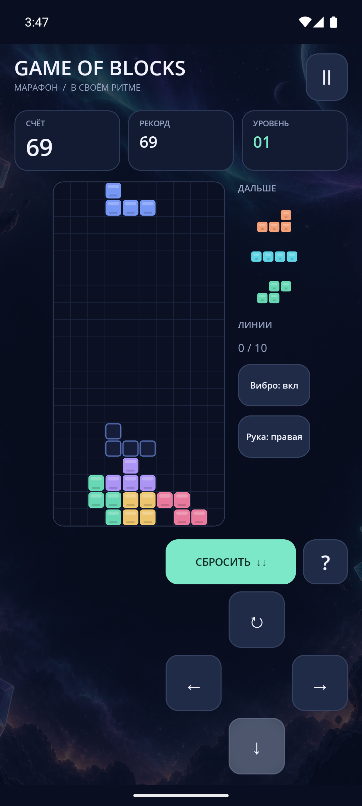

# NEON DROP

Тетрис на **C# / .NET 10 MAUI** с космическими иллюстрациями, светящимися фигурами и адаптивным интерфейсом для Android.



## Запуск на Windows

Нужны .NET SDK **10.0.401**, workload `maui-android`, **JDK 21**, Android SDK с платформой **API 36**, `platform-tools`, `emulator` и созданный AVD. Проверено на Android 15 / API 35; минимальная версия приложения — Android 8 / API 26.

```powershell
dotnet workload install maui-android
.\scripts\run-android.ps1
```

Скрипт находит SDK в `ANDROID_HOME`, `ANDROID_SDK_ROOT` или `%LOCALAPPDATA%\Android\Sdk`, JDK — в `JAVA_HOME` или `C:\Program Files\Android\openjdk`. Он запускает эмулятор при необходимости, собирает и устанавливает APK, затем открывает игру.

```powershell
.\scripts\run-android.ps1 -Avd "pixel_7_-_api_35"
.\scripts\run-android.ps1 -Serial emulator-5554
.\scripts\check.ps1
```

Готовый APK после скрипта: `src/NeonTetris/bin/run-android/com.mbobka.neondrop-Signed.apk`. Это локальная Debug-сборка, подписанная стандартным отладочным ключом.

Только тесты, без Android SDK:

```powershell
dotnet test tests/NeonTetris.Core.Tests
```

## Игра

- Поле 10×20, генератор 7-bag, вращения SRS с wall kicks, задержка фиксации 500 мс.
- Три следующих фигуры, контур приземления.
- Мягкое/мгновенное падение, рост скорости каждые 10 линий, рекорд.
- Виброотклик с выключателем, удержание кнопок движения, жесты по полю.
- Автосохранение каждые 2 секунды и при уходе в фон; восстановление на паузе.
- Полностью локальная игра без аккаунта и сетевых разрешений.

| Действие | Кнопки / клавиатура |
| --- | --- |
| Движение | ← / →; удержание повторяет движение |
| Поворот | ↻, ↑ или X; Z — против часовой стрелки |
| Мягкое падение | ↓ |
| Мгновенное падение | «СБРОСИТЬ» / пробел |
| Пауза | Ⅱ / P / Esc |
| Начать / продолжить | «ИГРАТЬ» / Enter |

Касание поля поворачивает фигуру; горизонтальный свайп сдвигает на клетку, свайп вниз делает мягкое падение.

## Планшеты и складные экраны

Размеры вычисляются по текущему окну. В широком режиме поле и панели расположены рядом. AndroidX WindowManager сообщает о разделяющих сгибах; поле целиком помещается в безопасную область, управление — в соседнюю. Учитываются несколько сгибов и шарниры нулевой толщины. При слишком маленьком окне игра предлагает увеличить доступное место и сохраняет партию на паузе.

Поворот, resize, переход в фон и смена posture ставят игру на паузу. Системные панели и вырезы учитываются отдельно от шарниров.

Обзор моделей по состоянию на **10.09.2026** и официальные источники: [foldables.md](docs/foldables.md). Результаты локальных испытаний: [testing.md](docs/testing.md). Работа на реальных foldable-устройствах и их внешних экранах зависит от OEM и отдельно не сертифицирована.

## Структура

- `src/NeonTetris.Core` — независимый движок, снимки состояния и геометрия безопасных панелей.
- `src/NeonTetris` — MAUI UI, GraphicsView, Android lifecycle и WindowManager.
- `tests/NeonTetris.Core.Tests` — тесты правил, вращений, таймингов, восстановления и сгибов.
- `scripts` — воспроизводимый запуск и проверка в PowerShell.

Иллюстрации созданы встроенным imagegen; [файлы и промпты](docs/artwork.md). [Сторонние ресурсы](docs/licenses/README.md).
